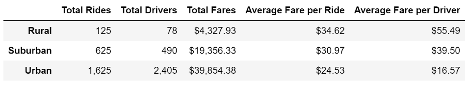

# PyBer Analysis

## Overview

### Background
Data was provided to me containing ride-sharing data for 2019. I was tasked with analyzing the data and providing a presentable chart to be used to show ride share trends throughout the year. 

### Purpose
The purpose of this project was to analyze ride-share data for 2019 and deliver a summary data frame filtered by city type. The second purpose was to produce a multiple-line chart of total fares for each city type.

## Results
Using the summary data frame showing different Fare statistics for each city type we can see clear trends for ride-share use, as well as cost. Ride-share use is highest in Urban areas, followed by suburban, and then rural areas. This is consistent with population density. This is also consistent with the highest total fares in Urban areas, followed by suburban, and rural areas. Where we see the most interesting trend, is in the average fare per ride analysis. Here we see that the average fare is highest in rural areas, followed by suburban, and cheapest in urban areas. This is also consistent with the highest average fare per driver being in rural areas, followed by suburban, and then urban areas. The likely explanation for this is simply supply and demand. There are far more drivers in rrban areas, thus a higher supply, so the rate is lower. In rural areas, there are few drivers, i.e. low supply, which amounts to high rates.

Using the multiple-line chart, we can visualize the trend of higher total fares earned by the ride-share company in urban areas, compared to suburban, and rural areas. As stated before, this is likely caused by far more rides being taken in Urban areas due to increased population density. 

Using the chart, we can also see a spike in fares for all city types at the end of February, especially in suburban areas. 

## Summary

Based on the results my recommendations to the CEO are as follows:
- If the goal is to lower the average fare for riders in suburban and urban areas, I would recommend attempting to increase the number of drivers per capita. Decreasing the fare per ride may encourage more riders to use the service.
- I would investigate any changes made during the end of February that may have caused the large spike in fares received, especially in suburban areas. This may be something that can be used in the future to increase revenue from suburban areas.
- A very small percentage of fares are gained from rural areas, which is likely caused by lower population density and fewer drivers. However, rural areas can be a much larger contributor if the company increases its brand awareness in rural communities. 
